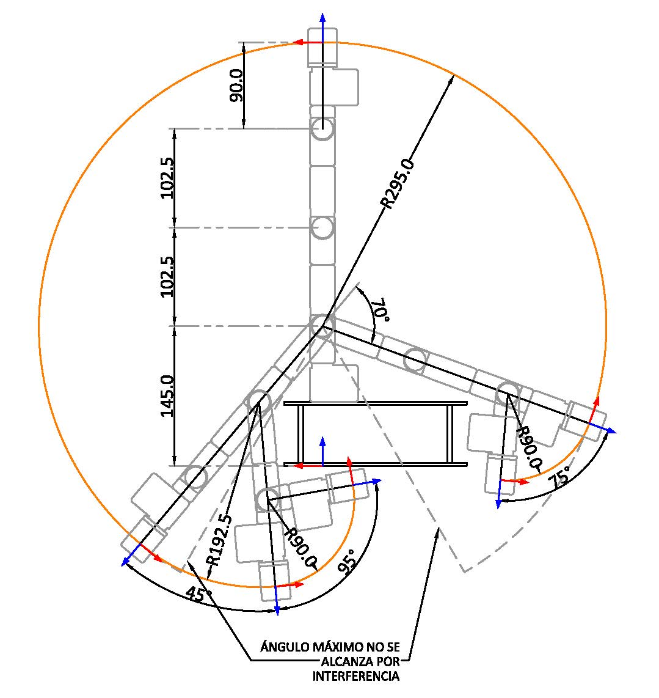

# Laboratory 3 - Inverse Kinematics - Phantom X - ROS
* Rafael Ricardo Galindo Leon
* Diego Fabian Osorio Fonseca

## Inverse Kinematics

A partir de la gráfica anterior podemos deducir las siguientes relaciones:

$$ T_T = \begin{bmatrix} n_x & o_x & a_x & x_T \newline n_y & o_y & a_y & y_T \newline n_z & o_z & a_z & z_T \newline 0 & 0 & 0 & 1 \end{bmatrix}$$
$$ r = \sqrt{x_T^2 + y_T^2} $$
$$ h = z_w - l_1 $$
$$ PosW = \begin{bmatrix} x_w \newline y_w \newline z_w \end{bmatrix} = \begin{bmatrix} x_T \newline y_T \newline z_T \end{bmatrix} - l_4 \begin{bmatrix} a_x \newline a_y \newline a_z \end{bmatrix} $$

**q1**

$$ q_1 = atan(y_T / x_T) \rightarrow  atan2(y_T, xT)$$

**q2**

Por análisis de mecanismo 2R:  

$$ \theta_3 = acos(\frac{r^2+h^2-l_2^2-l_3^2}{2 l_3 l_3}) $$

$$ q_2 = -\pi/2 + atan2(h,r) - atan2(l_3 sin(\theta_3),l_2+l_3*cos(\theta_3)) $$

**q3**

$$ q_3 = \theta_3 $$
Nota: Para cambiar los valores de las articulaciones de q_2 y q_3 para las cofiguraciones de codo arriba o codo abajo únicamente hay que cambiar a theta3 de signo

**q4**
$$ R_{pitch} = \begin{bmatrix} cos(q_1) & sin(q_1) & 0 \newline -sin(q_1) & cos(q_1) & 0 \newline 0 & 0 & 1 \end{bmatrix}  R_T$$

$$ pitch = atan2(R_{p31},R_{p11}) $$

$$ q_4 = pitch - q_2 - q_3 $$

### Workspace

## Pick and Place

## Movement in task space

