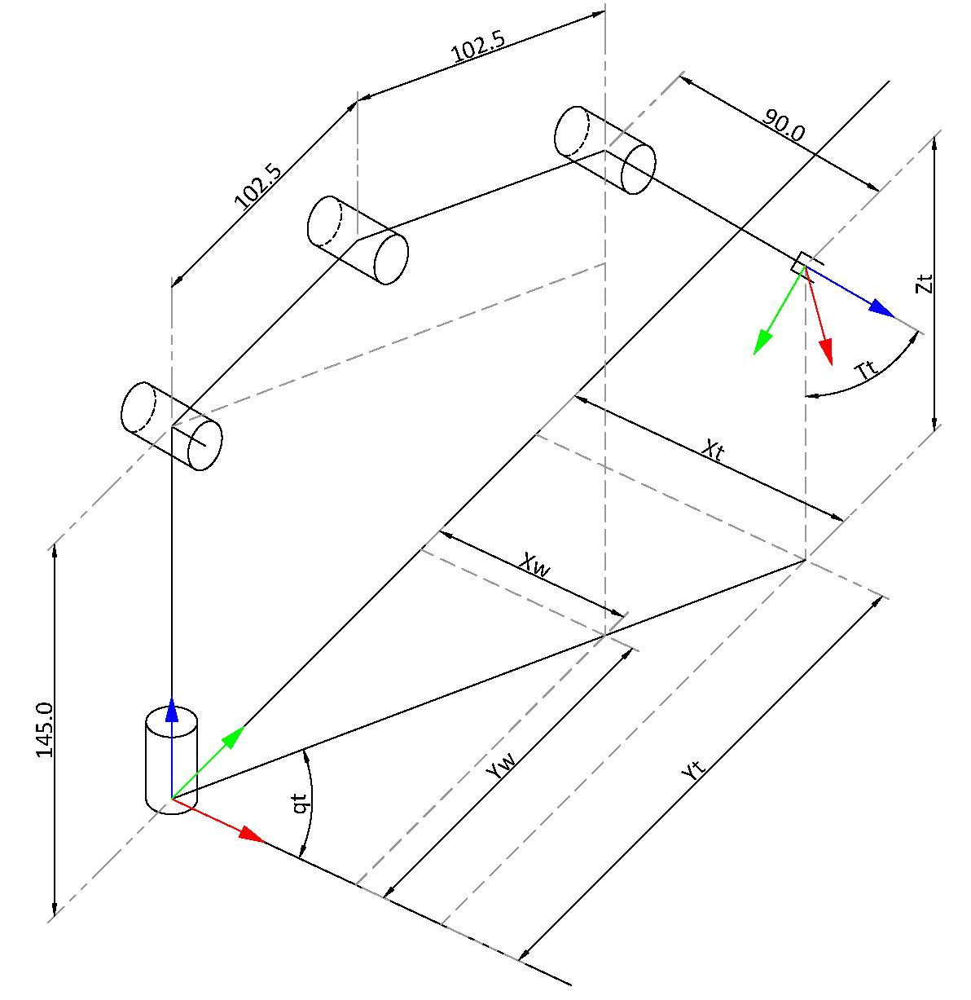
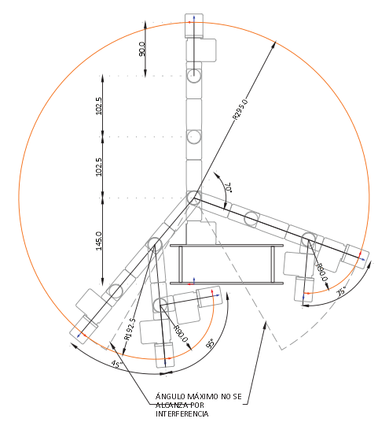

# Laboratory 3 - Inverse Kinematics - Phantom X - ROS
* Rafael Ricardo Galindo Leon
* Diego Fabian Osorio Fonseca

## Inverse Kinematics

**q1**

$$ q_1 = atan(y_T / x_T) \rightarrow  atan2(y_T, xT)$$

**q2**

**q3**

**q4**

### Workspace

## Pick and Place

## Movement in task space

