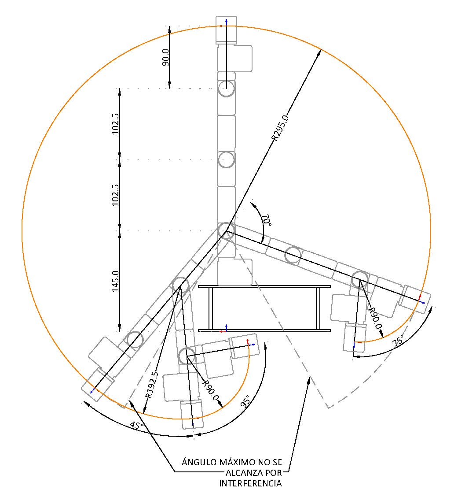

# Laboratory 3 - Inverse Kinematics - Phantom X - ROS
* Rafael Ricardo Galindo Leon
* Diego Fabian Osorio Fonseca

## Inverse Kinematics

From the above representación we can deduce the next equations:
$$ r = \sqrt(x_T^2 + y_T^2) $$
$$ h = z_w - l_1 $$

**q1**

$$ q_1 = atan(y_T / x_T) \rightarrow  atan2(y_T, xT)$$

**q2**
Por análisis de mecanismo 2R

**q3**

**q4**

### Workspace

## Pick and Place

## Movement in task space

