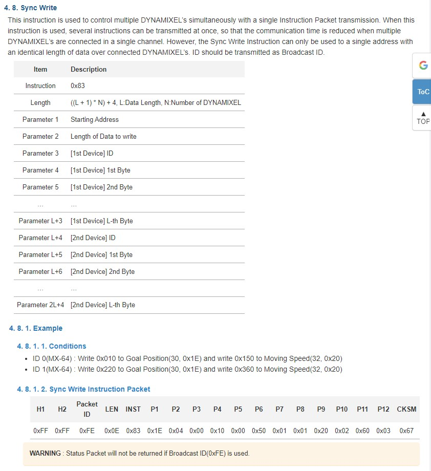

# Laboratory 3 - Inverse Kinematics - Phantom X - ROS
* Rafael Ricardo Galindo Leon
* Diego Fabian Osorio Fonseca


## Inverse Kinematics


A partir de la gráfica anterior podemos deducir las siguientes relaciones:

$$ T_T = \begin{bmatrix} n_x & o_x & a_x & x_T \newline n_y & o_y & a_y & y_T \newline n_z & o_z & a_z & z_T \newline 0 & 0 & 0 & 1 \end{bmatrix}$$
$$ r = \sqrt{x_T^2 + y_T^2} $$
$$ h = z_w - l_1 $$
$$ PosW = \begin{bmatrix} x_w \newline y_w \newline z_w \end{bmatrix} = \begin{bmatrix} x_T \newline y_T \newline z_T \end{bmatrix} - l_4 \begin{bmatrix} a_x \newline a_y \newline a_z \end{bmatrix} $$


**q1**

$$ q_1 = atan(y_T / x_T) \rightarrow  atan2(y_T, xT)$$

**q2**

Por análisis de mecanismo 2R: <br>

$$ \theta_3 = acos(\frac{r^2+h^2-l_2^2-l_3^2}{2 l_3 l_3}) $$

$$ q_2 = -\pi/2 + atan2(h,r) - atan2(l_3 sin(\theta_3),l_2+l_3*cos(\theta_3)) $$

**q3**

$$ q_3 = \theta_3 $$
Nota: Para cambiar los valores de las articulaciones de q_2 y q_3 para las cofiguraciones de codo arriba o codo abajo únicamente hay que cambiar a theta3 de signo

**q4**
$$ R_{pitch} = \begin{bmatrix} cos(q_1) & sin(q_1) & 0 \newline -sin(q_1) & cos(q_1) & 0 \newline 0 & 0 & 1 \end{bmatrix}  R_T$$

$$ pitch = atan2(R_{p31},R_{p11}) $$

$$ q_4 = pitch - q_2 - q_3 $$

Se realizó la implementación de esta cinemática inversa en una función de Matlab que se puede ver en el directorio px_robot/matlab/invKinPhantomX.m

### Workspace
Para determina  el espacio de trabajo del motor se realiza un diagrama geométrico simplificado del mismo con los datos medidos del robot físico, se determina el espacio de trabajo del motor en el plano XZ del origen, considerando que es el plano que más variaciones tiene, especialmente si se considera que el plano XY es un circulo competo debido a la acción rotacional del primer actuador, y el espacio de trabajo en el plano YZ es muy similar al plano de trabajo en el Plano XZ solo que con menos restricciones por interferencia.

Se entiende que esto forma una geometría semiesférica con un vacío interno, definido por la interferencia que realiza el robot consigo mismo.
De forma detallada se toma el modelo geométrico de cada eslabón, incluyendo la base del robot y se realizan los movimientos angulares máximos posibles para cada rotación, buscando los limites en los cuales el robot comienza a generar interferencia consigo mismo o con la base, o los puntos en los cuales el actuador llega a su máximo.

Como se puede evidenciar en la imagen siguiente se puede ver que de forma simple el espacio de trabajo está compuesto por una geometría esférica  de 250° en la parte superior, en la parte inferior dicha geometría no se conserva debido a la interferencia que tiene el robot consigo mismo y con su base, en el diagrama se asume que el robot es capaz de actuar bajo su propia base, esto significa que no existe ninguna superficie en dicha zona que se lo impida, esto puede cambiar de acuerdo al sistema de montaje que tenga el robot.

En la imagen se puede evidenciar que cuando una articulación llega a su límite ya sea del motor o por interferencia, la siguiente articulación puede continuar en la misma dirección hasta que esta se vea limitada.

Adicionalmente es importante considerar que para el presente ejercicio se toma como eje coordenado inicial el punto colineal con la primera articulación que se encuentra en el nivel más inferior de la base, y se está tomando como eje coordenado del efector final el centro de las mordazas a aproximadamente la mitad de la atura, se toma debido a que es una zona segura operativamente, ya que le permite al objeto que se busca recoger, tener tolerancia en su ubicación sin correr el riesgo de no ser agarrado.


## Pick and Place

El código para la parte de pick and place se basa principalmente en reconocer los vértices de la ruta que debe realizar el efector final y generar con dicha pose las rutas interpolando entre dichos puntos, al tener las poses para todos los puntos por los que se debe desplazar al efector final se realiza el cálculo para cada uno de ellos de las matrices de transformación homogénea MTH, luego se realiza el cálculo de la cinemática inversa, para todos los casos se usa la solución codo arriba. 

Para hacer esta implementación se usó Matlab. De forma detallada el código es como sigue:
### Cálculo de los vértices de la trayectoria.
En esta parte se determinan las coordenadas en las cueles se van a colocar las piezas que deben moverse para realizar el proceso de ensamblaje, en esta parte se procura que estas coordenadas estén en una zona central del espacio del trabajo, y que el ángulo de ataque del efector final sea vertical para minimizar los cálculos de la cinemática inversa.
``` matlab
%% Posiciones 
%% Se calcula las posiciones de los vértices de la ruta que debe realizar el robot.

d = 15; % Radio de los puntos de acenso y descenso
h = 5; % Desfase en altura entre el desplazamiento y el agarre de la pieza
TRa = transl(0,-d,10)*trotz(-pi/2)*troty(-pi); % Matriz de translacion Derecha Arriba
TRb = transl(0,-d,h)*trotz(-pi/2)*troty(-pi); % Matriz de translacion Derecha Abajo

TLa = transl(0,d,10)*trotz(pi/2)*troty(-pi); % Matriz de translacion Izquierda Arriba
TLb = transl(0,d,h)*trotz(pi/2)*troty(-pi); % Matriz de translacion Izquierda Abajo

TCa = transl(d,0,10)*troty(-pi);  % Matriz de translacion Centro Arriba
TCb = transl(d,0,h)*troty(-pi);  % Matriz de translacion Centro Abajo
```
 ### Definición de las características geométricas del robot.
En esta parte se toman las características geométricas reales del robot y se construye con ellas el modelo del robot cumpliendo con el modelo de Denavit and Hartenberg, este modelo es de gran importancia porque nos permite verificar que el modelo con el que se trabaja corresponde con el robot real, de esta forma se puede verificar los comportamientos y sistemas de coordenadas, para evitar que el robot se estrelle o pueda generar un accidente, en caso de que se tengan mal planteados los sistemas.

``` matlab
%% Robot plot
%% Se definen los parámetros geométricos del robot.
l = [14.5, 10.25, 10.25, 9]; % Links lenght
% Robot Definition RTB
%% Se construye el modelo geométrico del robot en el toolbox del Peter Corke
L(1) = Link('revolute','alpha',pi/2,'a',0,   'd',l(1),'offset',0,   'qlim',[-3*pi/4 3*pi/4]);
L(2) = Link('revolute','alpha',0,   'a',l(2),'d',0,   'offset',pi/2,'qlim',[-3*pi/4 3*pi/4]);
L(3) = Link('revolute','alpha',0,   'a',l(3),'d',0,   'offset',0,   'qlim',[-3*pi/4 3*pi/4]);
L(4) = Link('revolute','alpha',0,   'a',0,   'd',0,   'offset',0,   'qlim',[-3*pi/4 3*pi/4]);
PhantomX = SerialLink(L,'name','Px');
PhantomX.tool = [0 0 1 l(4); -1 0 0 0; 0 -1 0 0; 0 0 0 1];
% Plotting
q = [0  0 0 0]; %% Home
q_rad = deg2rad(q);
PhantomX.plot(q_rad,'notiles','noname');
hold on
ws = [-50 50];
trplot(eye(4),'rgb','arrow','length',15,'frame','0')
axis([repmat(ws,1,2) 0 60])
```
### Interpolación entre vértices para las rutas.
Se realiza el proceso de interpolación ente los vértices que forman parte de la trayectoria, considerando el sentido de desplazamiento y realizando interpolaciones con espaciados diferentes para los movimientos que son horizontales y los movimientos verticales, este valor se usa para que la distancia entre puntos de la interpolación sea aproximadamente la misma, dejándolos un poco más cercanos en las rutas verticales, dado que ese movimiento es más sensible a errores, porque en esos trayectos se interactúa con las piezas y un movimiento brusco puede afectar el desarrollo de la operación. En este caso las rutas que se repiten, como las rutas verticales en el centro, se interpolan solo una vez.

``` matlab
% Rutas
%% Se Calcula la interpolación entre vértices para hacer una ruta más suave.
%% Se usa un numero de interpolaciones para las rutas 
%% horizontales y otro para las rutas verticasles.
n = 30; % Numero de interpolaciones de ruta Horizontal.
n2 = 15; % Numero de interpolaciones de ruta Vertical
TC_R = ctraj(TCa,TRa,n); % Ruta Centro Arriba -- Derecha Arriba
TR_C = ctraj(TRa,TCa,n); % Ruta Derecha Arriba -- Centro Arriba
TC_L = ctraj(TCa,TLa,n); % Ruta Centro Arriba -- Izquierda Arriba
TL_C = ctraj(TLa,TCa,n); % Ruta Izquierda Arriba -- Centro Arriba
TC_a = ctraj(TCb,TCa,n2);  % Ruta Centro Abajo -- Centro Arriba
TC_b = ctraj(TCa,TCb,n2);  % Ruta Centro Arriba -- Centro Abajo
TR_a = ctraj(TRb,TRa,n2);  % Ruta Derecha Abajo -- Derecha Arriba
TR_b = ctraj(TRa,TRb,n2);  % Ruta Derecha Arriba -- Derecha Abajo
TL_a = ctraj(TLb,TLa,n2);  % Ruta Izquierda Abajo -- Izquierda Arriba
TL_b = ctraj(TLa,TLb,n2);  % Ruta Izquierda Arriba -- Izquierda Abajo
```
### Cálculo de las posiciones del Gripper.
Para calculas los valores necesarios de cierre y apertura del gripper se fabricaron las piezas a operar primero, considerando que el mecanismo de cierre del gripper no es lineal respecto al ángulo de rotación del motor, debido al mecanismo que usa para la acción, se realizó una medición manual desde la interface de Dynamixel, realizando un experimento de cierre sobre la pieza para garantizar que la apertura es suficiente para contener la pieza sin impactarla y que el cierre es lo suficientemente justo para evitar que la pieza se caiga por gravedad o por los movimientos, pero que el cierre no sea demasiado que se corra el riesgo de dañar el mecanismo de cierre o de saturar la capacidad de torque del motor.

``` matlab
%% Valores para las posisiones del gripper
open = 0;
close = 0.8624;%mapfun(680,0,1023,deg2rad(-150),deg2rad(150))
```

### Calculo de la cinematica inversa de la ruta completa.
Teniendo las MTH’s para todas las interpolaciones entre vértices se realiza un proceso para calcular para cada una de esas MTH’s los valores angulares para cada uno de los actuados que nos permiten llegar con el efector final a la posición deseada, para esto se usa la función de cinemática inversa por el método geométrico y de desacople obtenida.

``` matlab
%% Calculo de la ruta completa, teniendo en cuenta los 
%% vértices y los puntos de interpolación.

%home
q_home = [0 0 0 0 open];

%Pos ini - centro arriba
qC_a = [P1 open];

%Centro a derecha
for i=1:n
   qinv = invKinPhantomX(TC_R(:,:,i),'up');
   qC_R(i,:) = [qinv open];
end

%Derecha abajo y cerrar
for i=1:n2
   qinv = invKinPhantomX(TR_b(:,:,i),'up');
   qR_b(i,:) = [qinv open];
end
qR_b = [qR_b; P3 open; P3 close];


%Derecha arriba
for i=1:n2
   qinv = invKinPhantomX(TR_a(:,:,i),'up');
   qR_a(i,:) = [qinv close];
end
% qR_a = [P2 close];

%Derecha a Centro
for i=1:n
   qinv = invKinPhantomX(TR_C(:,:,i),'up');
   qR_C(i,:) = [qinv close];
end

%Centro abajo y abrir
for i=1:n2
   qinv = invKinPhantomX(TC_b(:,:,i),'up');
   qC_b(i,:) = [qinv close];
end
qC_b = [qC_b; P6 close; P6 open];

%Centro arriba 2
for i=1:n2
   qinv = invKinPhantomX(TC_a(:,:,i),'up');
   qC_a2(i,:) = [qinv open];
end

%Centro a izquierda
for i=1:n
   qinv = invKinPhantomX(TC_L(:,:,i),'up');
   qC_L(i,:) = [qinv open];
end

%Izquierda abajo y cerrar
for i=1:n2
   qinv = invKinPhantomX(TL_b(:,:,i),'up');
   qL_b(i,:) = [qinv open];
end
qL_b = [qL_b; P5 open; P5 close];

%Izquierda arriba
for i=1:n2
   qinv = invKinPhantomX(TL_a(:,:,i),'up');
   qL_a(i,:) = [qinv close];
end
qL_a = [qL_a; P4 close];

%Izquierda a centro
for i=1:n
   qinv = invKinPhantomX(TL_C(:,:,i),'up');
   qL_C(i,:) = [qinv close];
end

%Centro abajo y abrir

%Centro arriba 2
```

### Composición definitiva de la ruta.
Se realiza el proceso de compilado de todos los pasos de la ruta, se apilan los valores angulares de los motores para cada recorrido, teniendo presente que se deben repetir los pasos de la forma deseada.

``` matlab
%Matriz total de valores articulares de la ruta completa.
qTotal = [q_home;
          qC_a;
          qC_R;
          qR_b;
          qR_a;
          qR_C;
          qC_b;
          qC_a2;
          qC_L;
          qL_b;
          qL_a;
          qL_C;
          qC_b;
          qC_a2];
```
### Inicialización del servicio en ROS
Teniendo calculados todos los puntos de la ruta con su cinemática inversa, se procede a inicializar el proceso para realizar el control del robot.

``` matlab
%% ROS Connection 
rosinit
%%
motorSvcClient = rossvcclient('dynamixel_workbench/dynamixel_command');%creacion del cliente
motorCommandMsg = rosmessage(motorSvcClient);%creacion del mensaje
```
### Configuración de la velocidad máxima.
Se realiza una configuración de los motores AX12 del Phantom, esta configuración se hace al verificar la existencia de la función en el manual del Dynamixel, esta función presenta beneficios comparada con la que se usa en casos anteriores de Torque_Limit, principalmente porque en algunas trayectorias el torque necesarios puede ser mayor al establecido, lo cual arria que los motores entren error debido a que no pueden llegar a la posición deseada, cosa que no pasa definiendo como limite la velocidad, debido a que en este caso los motores pueden usar todo el torque posible, adicionalmente es mejor controlar la velocidad debido a que esto hace que la operación de los motores sea menos acelerada y se esfuercen mucho menos mecánicamente y eléctricamente, además de dar un tiempo de respuesta mayor en caso de que puedan presentarse choques, ya sea con algún elemento o persona, haciendo tono el sistema mas seguro.
La informacion detallada de como funciona dicha funcion se peude encontrar en el siguente link: https://emanual.robotis.com/docs/en/dxl/ax/ax-12w/#moving-speed La forma de definirlo es como se puede ver en la siguiente imagen:


``` matlab
%% Configuracion de la velocidad maxima para todas 
%% las articulaciones, para garantizar que los motores 
%% no se mueven a altas velocidades, con esto se evita 
%% reducierles el torque a los motores y se tiene tiempo
%% para prevenir choques del robot.
motorCommandMsg.AddrName = "Moving_Speed";
motorCommandMsg.Value = 100;
motorCommandMsg.Id = 1;
call(motorSvcClient,motorCommandMsg);
motorCommandMsg.Id = 2;
call(motorSvcClient,motorCommandMsg);
motorCommandMsg.Id = 3;
call(motorSvcClient,motorCommandMsg);
motorCommandMsg.Id = 4;
call(motorSvcClient,motorCommandMsg);
motorCommandMsg.Id = 5;
call(motorSvcClient,motorCommandMsg);
```
### Ejecución de los movimientos.
Como se puede ver a continuación, para realizar la ejecución de los movimientos se usa una función iterativa que toma cada uno de los valores objetivo y se los asigna al motor indicado, de esta forma se realiza el movimiento, en este caso y en la operación se puede evidenciar que los movimientos se realizan de forma consecutiva, esto genera que los movimientos en los que deben actuar más de un motor se vean como un proceso escalonado, impulsivo y errático, esto se debe a que al enviar el comando de movimiento a un motor este debe responder si pudo ejecutar el movimiento, lo cual obliga a esperar hasta que dicho movimiento sea ejecutado, impidiendo así realizar movimientos simultáneos.
El protocolo 1.0 de Dynamixel considera una solución a esto con la función Sync Write como se muestra en la siguiente imagen:


Esta función se encuentra en https://emanual.robotis.com/docs/en/dxl/protocol1/#instruction-details y con ella se puede realizar un comando simultaneo a varios motores con las funciones de Goal Position y Moving Speed, estas dos funciones pueden permitir realizar un movimiento mucho más suave y acercado a la ruta deseada dado que al poder determinar la velocidad y la posición objetivo para cada motor y que la acción se ejecute de forma simultanea se puede obtener un movimiento muy cercano al rectilíneo, siempre y cuando los puntos inicial y final no estén muy distantes ente si, adicionalmente esto permite que el robot no se vea esforzado por las constantes aceleraciones y desaceleraciones dado que el siguiente movimiento a ejecutarse será más colineal con el anterior, cosa que no pasa con el comando Goal Position dado que un motor realiza su desplazamiento y debe detenerse completamente para permitir que el otro motor actúe, adicionalmente el bus de comunicación se verá mucho menos utilizado dado que así se le envían comandos simultáneos a todos los motores y no debe realizarse un comando a cada motor y espera su respuesta.

Sin embargo, esta función aún no está implementada en la librería que se usa por tal motivo no se hace uso de la misma.

``` matlab
%% Se ejecutan los movientes de todas las articulaciones
%% para cumplir con la ruta planeada, al usar la 
%% función Goal_Position se presenta el inconveniente
%% de que el robot no ejecuta la siguiente acción hasta 
%% que se haya completado la primera.
motorCommandMsg.AddrName = "Goal_Position";
for j=1:length(qTotal)
    for i=1:5
        if j~=1
           if qTotal(j,i)~=qTotal(j-1,i)
               motorCommandMsg.Id = i;
               motorCommandMsg.Value = round(mapfun(qTotal(j,i),deg2rad(-150),deg2rad(150),0,1023));
               call(motorSvcClient,motorCommandMsg);
           end
        else
            motorCommandMsg.Id = i;
            motorCommandMsg.Value = round(mapfun(qTotal(j,i),deg2rad(-150),deg2rad(150),0,1023));
            call(motorSvcClient,motorCommandMsg);
        end
        
    end
end
```


## Movement in task space

Para realizar la segunda parte de este laboratorio se decidió trabajar en un Script en Python. Este Script tiene el nombre de ***keyboardMove.py*** que se encuentra en la carpeta px_robot/scripts. Dentro de este Script se encuentra también la función de cinemática inversa implementada en Matlab.

Para realizar este ejercicio se creó una función principal que es la que realiza la modificación de la matriz de transformación del TCP de la herramienta. Esta función: ***changeT*** recibe 3 argumentos. Primero *numMov*, que corresponde al tipo de movimiento que se quiere realizar: de 1 a 3 para traslación en x, y, z respectivamente y 4 para rotación sobre el eje O del TCP. Luego, *T_actual* que es la matriz actual que se quiere modificar y finalmente *direction* que es 1 si se quiere la dirección positiva o -1 si se quiere negativa. 

Lo primero que se hace dentro de esta funció es obtener el Pose del TCP en coordenadas x,y,z y en ángulos de euler. Eso se hace con las funciones del toolbox de Peter Corke. Estas posiciones y orientaciones se empiezan a modificar dependiendo del tipo de movimiento. Por ejemplo, si se quiere un "traY" es necesario sumarle un valor a la posición Y, y adempas modificar uno de los ángulos de Euler que cambia al cambiar esta posición. Posteriormente se calcula una nueva matriz de transformación con los nuevos valores que han sido modificados y esta es la que se retorna. 

``` python
def changeT(numMov, T_actual, direction):
    X, Y, Z = transl(T_actual)
    aZ1, aY, aZ2 = tr2eul(T_actual) #verificar que las funciones del toolbox se usen igual en python
    print(aZ2)
    d_tra = 1
    d_rot = 2*np.pi/180

    if numMov == 1:
        X = X + direction*d_tra
        aZ2 = -np.arctan2(Y,X)
    if numMov == 2:
        Y = Y + direction*d_tra
        aZ2 = -np.arctan2(Y,X)
    if numMov == 3:
        Z = Z + direction*d_tra
    if numMov == 4:
        aY = aY + direction*d_rot
    b = np.array([[X], [Y], [Z]])
    T_actual = rt2tr(eul2r(aZ1,aY,aZ2),b)
    return T_actual

```

Otras funciones importantes que se utilizaron son:

* ***setMovingSpeed*** para cambiar las velocidades de movimiento de los motores a una velocidad *speed* en bits

``` python
def setMovingSpeed(speed):
    for i in range(4):
        jointCommand('',i+1, 'Moving_Speed',speed, 0)   #Cambiar si cambian ID de motores
```

* ***moveLinks*** para comandar cada uno de los motores a la posición de la articulación deseada. La entrada es el vector *q* de valores articulares en radianes

``` python
def moveLinks(links):
    for i in range(4):
        jointCommand('',i+1, 'Goal_Position',round((links[i]-(-5*np.pi/6))*(1023/(5*np.pi/3))), 0)   #Cambiar si cambian ID de motores
```

* ***checkJointsValues*** para verificar que los valores de *q* se encuentren dentro de los límites del robot

``` python
def checkJointsValues(q):
    max = np.deg2rad(150)
    min = np.deg2rad(-150)
    if q[0]<max and q[0]>min:
        q1 = True
    else:
        q1 = False
        print("q1 value out of Limits")
    
    if q[1]<max and q[1]>min:
        q2 = True
    else:
        q2 = False
        print("q2 value out of Limits")

    if q[2]<max and q[2]>min:
        q3 = True
    else:
        q3 = False
        print("q3 value out of Limits")
    
    if q[3]<max and q[3]>min:
        q4 = True
    else:
        q4 = False
        print("q4 value out of Limits")
    
    return q1 and q2 and q3 and q4
```
Con estas funciones ya explicadas y definidas se puede realizar el codigo main que realiza los movimientos. Entoces, primero se define una posición inicial del robot en una MTH y con la cinemática inversa se calculan los valores articulares de esta MTH. Antes de mandar el robot a esta pose inicial, hacemos una configuración de la velocidad de movimiento para evitar movimientos fuertes en cada comando de posición de los motores. Cuando esto se ha hecho ya se manda al robot a esta posición inicial. Después de esto, se ejecuta un ciclo infinito en el que se puede ir escogiendo el tipo de movimiento que se quiere hacer y el comando de movimiento en dirección positiva y negativa. 

El cambio de movimiento se hace al oprimir las teclas W y S del teclado, con esto se aumenta o disminuye la variable *nMov* que es la que contiene esta infromación. La ejecución del movimiento positivo y negativo se hace con las teclas D y A, respectivamente. Para ejetutar estos movimientos primero se hace el cambio de la MTH actual con la función ***changeT*** explicada anteriormente, con el tipo de movimiento y dirección escogidas. Luego se calcula la cinemática inversa de esta nueva MTH y finalmente se comanda cada uno de los motores a esta posición articular calculada dependiendo de si estos valores calculados se encuentran dentro de los límites.

## Resultados

### Video
[Laboratorio 3 Robótica - Pick and Place, Movimiento en el espacio de la tarea](https://youtu.be/Qm2VoXwQtFI)

## Conclusiones
